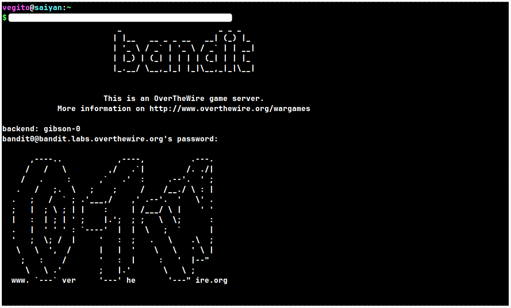

# Introduction: 
	
	This is my personal walkthrough series for OverTheWire's Bandit wargame. I'm not giving direct answers — just the theory, the commands you'll need to learn, and checkpoint screenshots so you know you're on the right track. The actual solving? That's on you. Let's begin.

## Level: 0
# Given Details -- 

- Host: **bandit.labs.overthewire.org**
- Port:  2220
- Username: bandit0
- Password: bandit0

# Goal -- 

   - Goal is to connect to the game using SSH. with Host and Port 

# Command Theory --  
	
	ssh

## ssh -- 
	secure shell is a protocol used to securely log into remote system, mainly used to logging and executing commands on a remote server.
	  

#### Syntax:   ssh username@remote_host 

#### Syntax:   ssh username@remote_host

> ⚠️ **Common mistake:** Don't forget to include the `username@` part before the host. 
> Running just `ssh remote_host` without a username will try to connect using your *local* machine's username instead — which will fail (or worse, silently try the wrong login). Always double check your full command includes `username@host`.

#### Flags:
	-i {path/to/key}: for specific private key to connect
	-p {port}: for specific port
	-t(tty) {command command_arguments}: flag for forcing ssh to "login, run one specific command and show the output"

## Walkthrough:

## Walkthrough:

### Checkpoint 1: Terminal before running any command

*This is what a fresh terminal looks like before you've connected to anything. Try running the ssh command yourself using the host, port, and username given above.*

### Checkpoint 2: After correctly executing the SSH command

*If your command was correct, this is what you should see. Compare it with your own output — did you land in the same place?*

