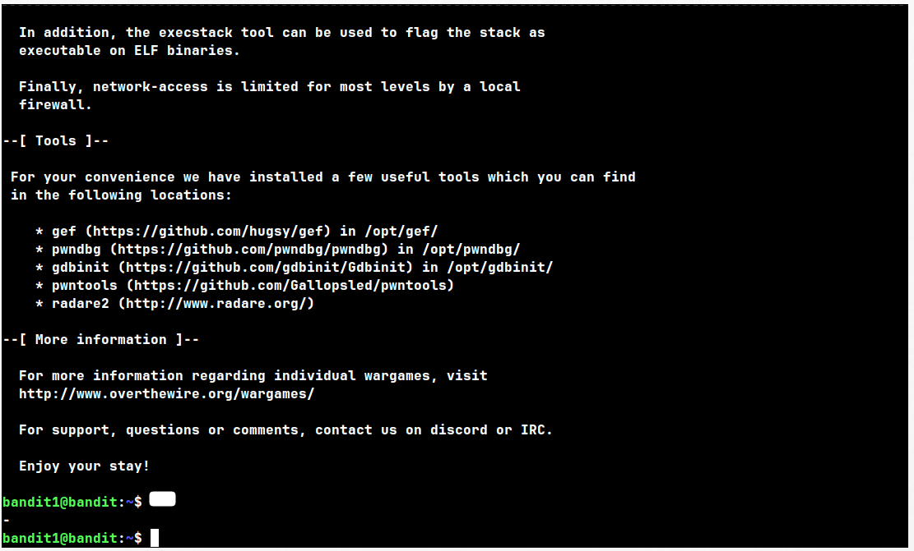
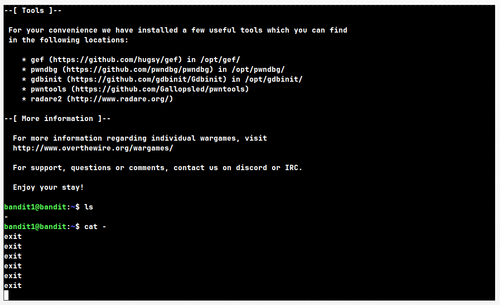

# Level 1 → 2

## Given Details --

	> The password for level 2 is stored in a file whose name is a single 
	  literal dash: "-"

	> Commands needed are the same as the previous level (ls, cat).

	> Hint: Syntax is fundamental here — pay attention to how the shell 
	  interprets a filename that starts with a dash.

## Goal --

	- Find the password for level 2, stored in bandit1's home directory,
	  in a file literally named "-".

## Theory --

	A filename starting with "-" causes a problem: most commands treat 
	anything starting with "-" as a *flag/option* remember flags like -l, -a — not a filename.
	
	 So running a command directly with a "-" won't behave the way you expect, and the command may misinterpret it or throw an error.
	 
	This is a common real-world problem, not just a CTF trick — it's why 
	  many commands support special syntax to explicitly separate flags 
	  from filenames, even when a filename starts with "-" or contains spaces.
	

	Think about how you might reference a file without letting the shell 
	misread its name as a flag. (Hint: paths help.)

## Walk-through --

	- With a clean terminal, SSH into bandit1 using the password you 
	  found in the Level 0 → 1 writeup. Remember to update the username 
	  when moving to a new level. And note down password.

	- List the contents of the home directory. You should see a single, 
	  unusually named file.

	- Try viewing its contents using the same command you used in the 
	  previous level. If it doesn't behave as expected, think about 
	  *why* — and how you might tell the command "this is a path, not 
	  a flag."
	
	- If your terminal appears "stuck" and won't return you to a prompt, 
	  or you type things like `exit` and just see them echoed back 
	  instead of anything happening — you haven't broken anything. 
	  Think about what `cat` does with a lone `-` as input, and why that 
	  might cause this behavior.

*If you see this, don't panic — press Ctrl+C to cancel the current process and get your prompt back.*

	- Once you reference the file correctly, you should see the 
	  password for level 2 printed to your terminal.

*This is what you should see after listing bandit1's home directory.*
