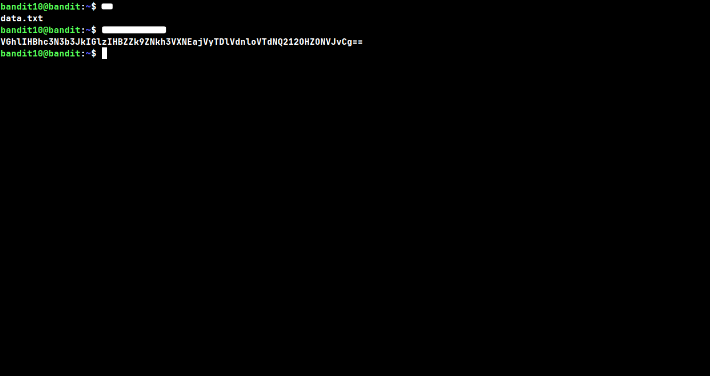
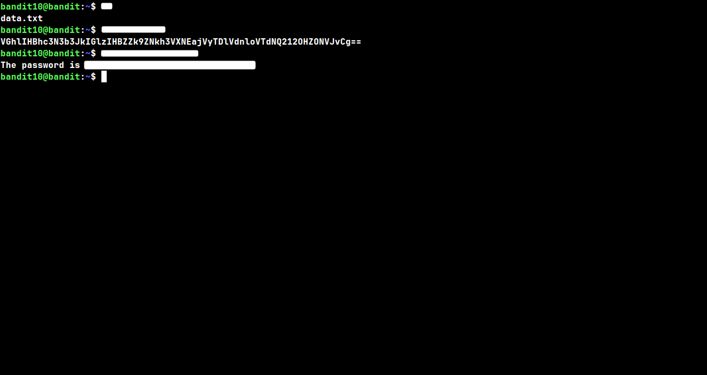

## Level: 10 → 11

# Given Details --

- The password for level 11 is stored in the file `data.txt`
- The file is base64 encoded
- Username for this level: bandit10

# Goal --

- Decode the base64 encoded contents of `data.txt` to reveal the password for level 11.

# Commands Needed --

```
base64
```

# Theory --

## base64 --

```
base64 isnt encryption, its just an encoding, theres a big difference. encoding just changes how data is represented so it can be safely passed around as plain text (like over email or in a config file) without breaking anything, it doesnt hide or protect the data at all. anyone with the base64 command, or even just a quick google search, can decode it back to normal in like two seconds.
```

#### Syntax: base64 filename (encodes) / base64 -d filename (decodes)

#### Common flags --

```
-d      decodes the input instead of encoding it
-i      ignores non alphabet characters while decoding, instead of erroring out
-w      wraps encoded output at a certain column width (0 disables wrapping completely)
```

> ⚠️ **Common mistake:** forgetting the `-d` flag will just try to encode the already-encoded text again, giving you a bigger useless blob instead of the original readable password.

## Walkthrough:

### Checkpoint 1: Viewing the raw file

 _After loging into bandit10, cat-ing `data.txt` shows a single line of text that doesnt look like a normal password, its got the tell tale `==` padding at the end which is a pretty good sign its base64 encoded._

### Checkpoint 2: Decoding the file

 _Running `base64 -d` on the file decodes it straight back to plain text, and sitting right there is the password for level 11._