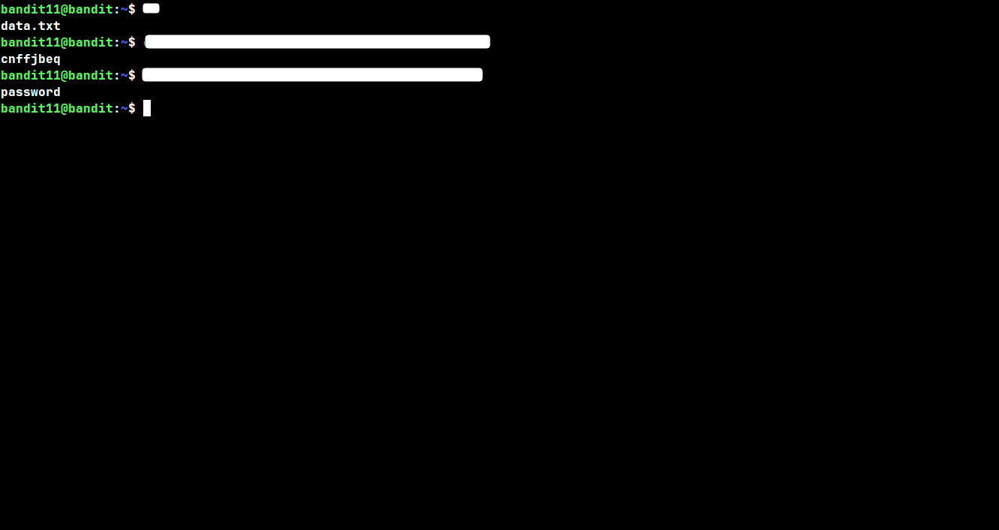
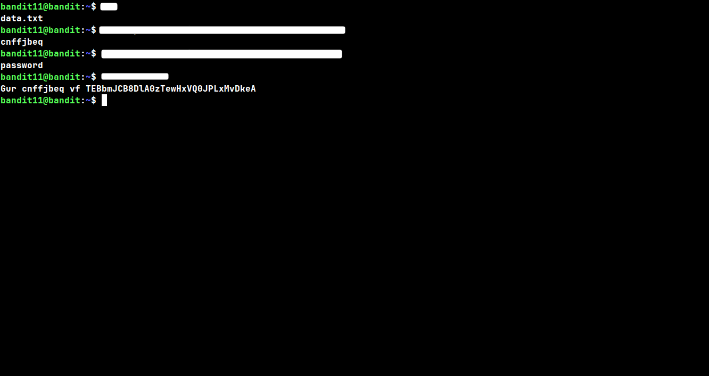
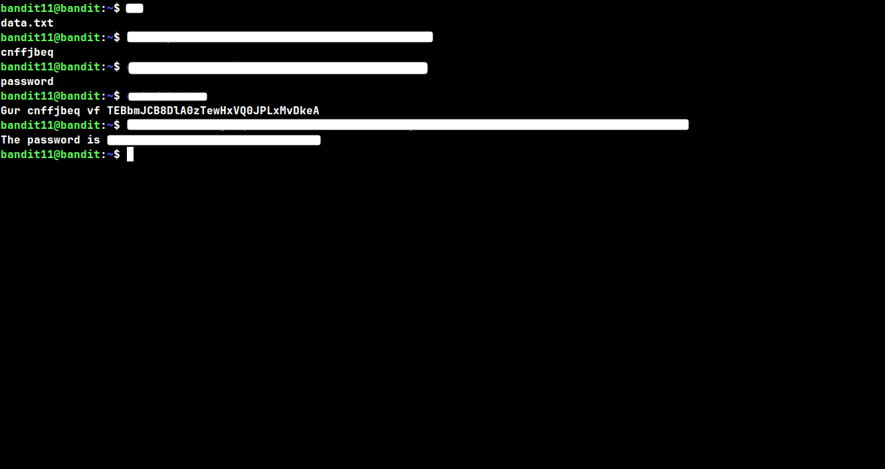

## Level: 11 → 12

# Given Details --

- The password for level 12 is stored in the file `data.txt`
- All letters in the file have been rotated by 13 places (ROT13)
- Username for this level: bandit11

# Goal --

- Decode the ROT13 cipher applied to `data.txt` to reveal the password for level 12.

# Commands Needed --

```
tr
```

# Theory --

## tr --

```
tr stands for translate, and all it does is swap characters from one set into another as text passes through it, its not aware of words or meaning, it just looks at each character one at a time and replaces it. that makes it perfect for something like ROT13, where every single letter just needs to shift to a different letter, nothing more complicated then that.
```

#### Syntax: tr 'set1' 'set2'

#### Common flags --

```
-d      deletes the characters instead of translating them
-s      squeezes repeated characters down into one (like turning "aaa" into just "a")
-c      uses the complement of the given set, so it matches everything NOT in set1
```

> ⚠️ **Common mistake:** forgetting to wrap the sets in quotes can make the shell try to interpret parts of it, especialy if theres any special characters mixed in the ranges.

## ROT13 --

```
ROT13 is a really simple substitution cipher, it just rotates every letter 13 places down the alphabet. its not real encryption at all, its more of an obfuscation trick, since the alphabet has 26 letters, rotating by 13 twice just brings you right back to where you started, which is why the exact same tr command both encodes and decodes it.
```

#### Syntax: tr 'A-Za-z' 'N-ZA-Mn-za-m'

## Walkthrough:

### Checkpoint 1: Testing the ROT13 logic

 _Before touching the actual file, its worth testing the tr command on a known word first to make sure the logic actually works. Piping "password" through the rotation gives back "cnffjbeq", and running that same rotated word back through the exact same command gives back "password" again, confirming ROT13 is symmetrical._

### Checkpoint 2: Viewing the raw file

 _After loging into bandit11, cat-ing `data.txt` shows a line of text thats clearly still english structure wise ("vf" instead of "is" kind of gives it away) but the letters are all scrambled, which is a pretty solid hint its ROT13._

### Checkpoint 3: Decoding the password

 _Piping the whole line from `data.txt` through the same tr rotation used earlier decodes the entire sentence at once, revealing the password for level 12._