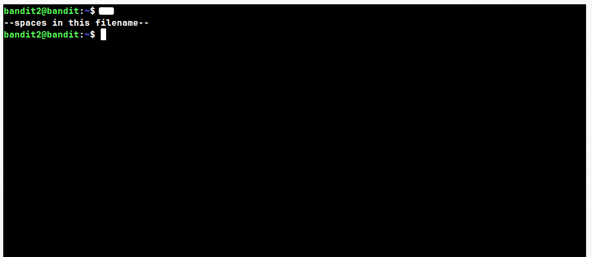
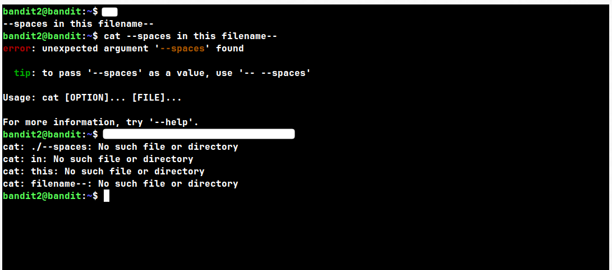
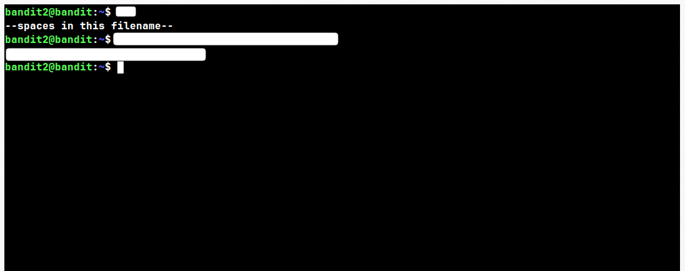

## Level: 2 → 3

# Given Details --

- The password for level 3 is stored in a file called `--spaces in this filename--`
- The file is located in bandit2's home directory
- Username for this level: bandit2

# Goal --

- Find the password for level 3, stored in a file whose name contains spaces and starts with two dashes.

# Commands Needed --

```
ls, cd, cat, file, du, find
```

# Theory --

## Filenames with spaces --

```
The shell normally uses spaces to separate arguments. So typing a filename that contains spaces without any special handling causes the shell to split it into several separate arguments instead of one filename.
```

#### Syntax: cat "filename with spaces"

> ⚠️ **Common mistake:** Typing a filename with spaces directly, with no quotes or escaping, will make the shell treat each word as a separate argument — not one filename.

#### Ways to handle spaces:

```
- Quoting: wrap the whole filename in double or single quotes.
- Escaping: place a backslash (\) directly before each space.
- Tab-completion: let the shell auto-insert the correct escaping for you.
```

## The "--" flag stopper --

```
Some commands (like the `cat` used in this environment) treat any argument starting with "--" as an option/flag, even if it's quoted. Quoting only controls how the *shell* splits arguments — it does not change how the *command* interprets what's inside.
```

#### Syntax: command -- filename

> ⚠️ **Common mistake:** Quoting a filename that starts with "--" is not enough on its own. The command may still throw an "unexpected argument" error because it thinks you're passing it an unrecognized flag.

```
The "--" symbol tells a command: "everything after this point is a literal argument, not a flag." This is a POSIX convention supported by most standard commands (ls, grep, rm, find, cat), not just one specific tool.
```

## Walkthrough:

### Checkpoint 1: Home directory listing

 _After logging into bandit2, list the contents of the home directory. Look closely at the exact filename shown — you'll need to reference it precisely, including the spaces and the dashes._

### Checkpoint 2: Quoting alone isn't enough

 _Quoting the filename correctly handles the spaces, but the command still returns an "unexpected argument" error. Read the tip in the error message closely — it points toward a symbol that tells the command "stop looking for flags, treat everything after this as a filename."_

### Checkpoint 3: Successfully reading the file

 _Combine the flag-stopper symbol with your quoted filename. If done correctly, this is what you should see — the password for level 3, printed to your terminal._