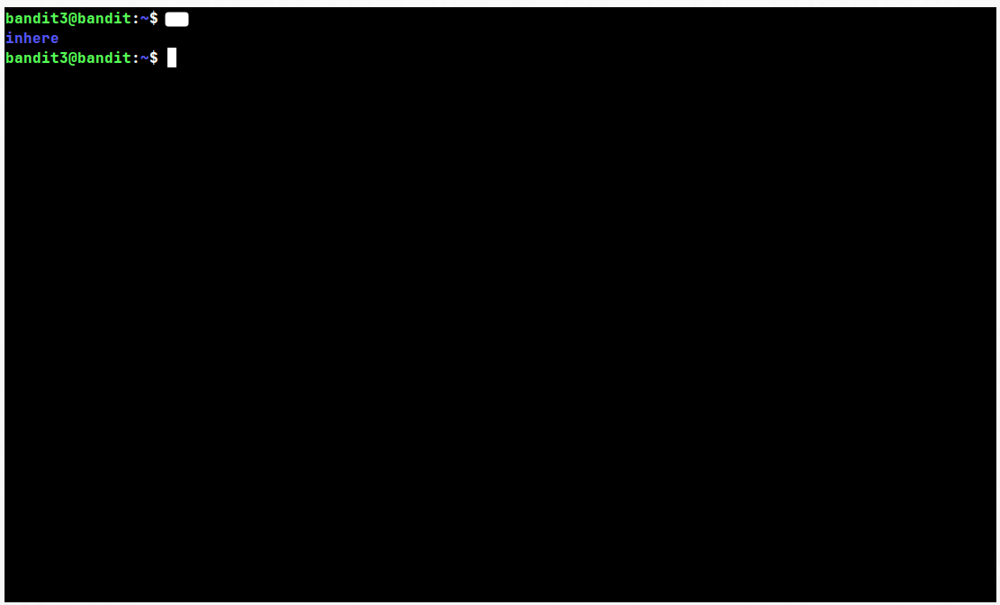
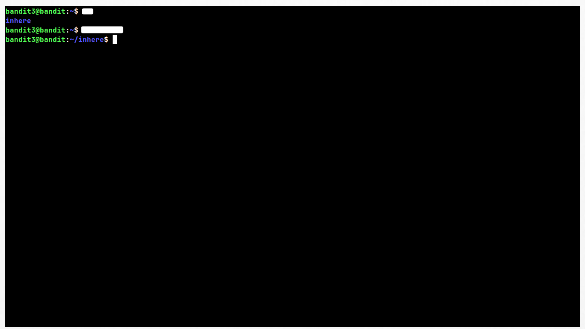
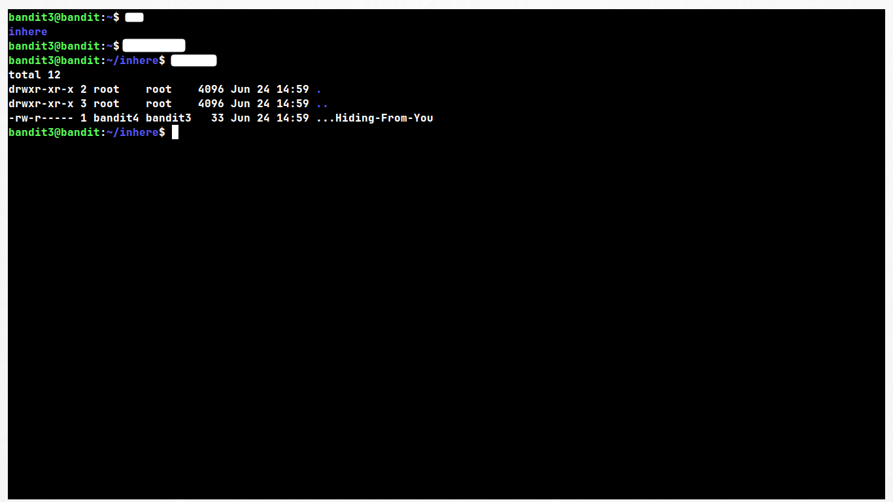
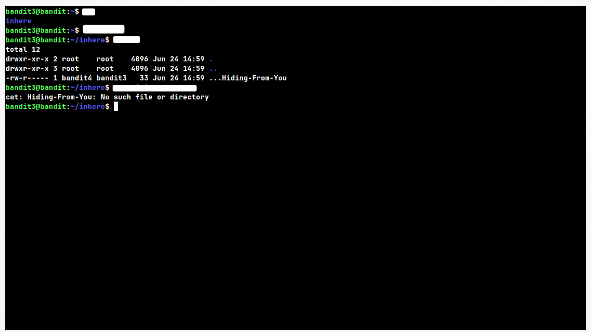
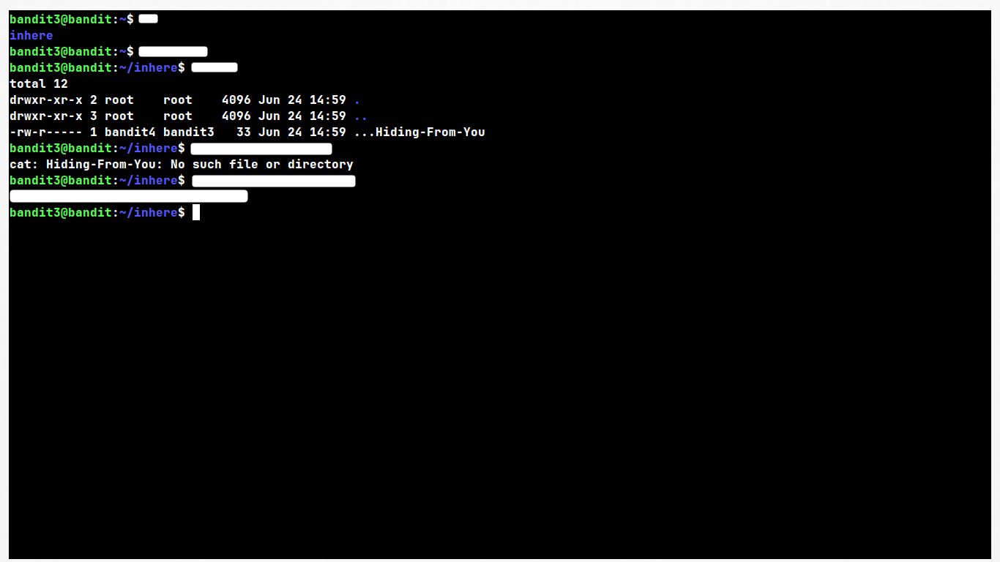

# Level 3 → 4

## Given Details --

	> The password for level 4 is stored in a hidden file inside a 
	  directory called "inhere", located in bandit3's home directory.

	> Commands needed are the same as previous levels (ls, cd, cat).

	> Hint: hidden files don't show up with a normal `ls`.

## Goal --

	- Find the password for level 4, stored in a hidden file somewhere 
	  inside the "inhere" directory.

## Theory --

	In Linux, any file or folder whose name starts with a dot (.) is 
	considered "hidden." Command that is used to list files/directory will not show these files — they are skipped by default.

	This isn't a security feature, just a convention to keep clutter 
	(like config files) out of normal directory listings.

	To list the file you need to use the listing command and it's flag. 

## Walk-through --

	- With a clean terminal, SSH into bandit3 using the password you 
	  found in the Level 2 → 3 writeup.

	- List the contents of the home directory. You should see a single 
	  folder.

	- Move into that folder and list its contents. If nothing shows up, 
	  don't assume the folder is empty, it's not. 

	- Try listing again with a flag that reveals hidden files.

	- Try viewing the file's contents using the filename you saw. If it 
	  doesn't work, check whether you typed the *entire* filename.

	- Once you reference the file correctly, you should see the 
	  password for level 4 printed to your terminal.

## How to create a hidden file yourself --

	Creating a hidden file is as simple as naming it starting with a dot.