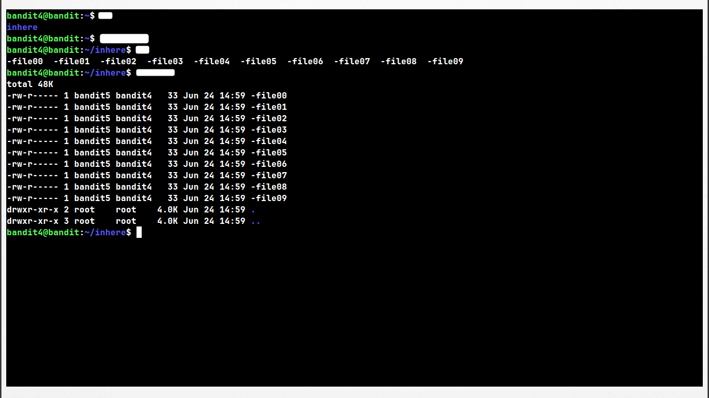
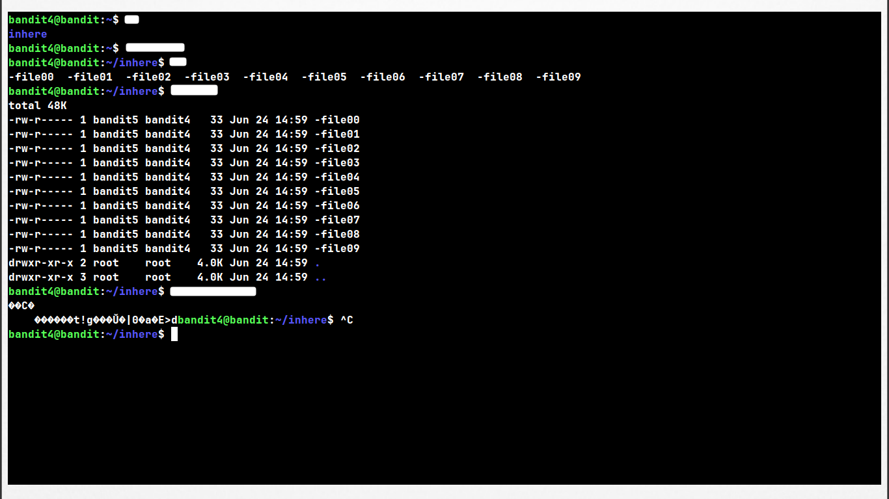
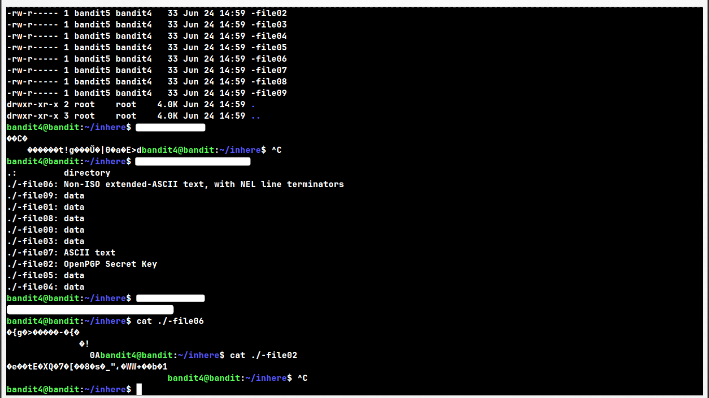

# Level: 4 → 5

# Given Details --

- The password for level 5 is stored in one of the files inside a directory called `inhere`
- The `inhere` directory is located in bandit4's home directory
- The correct file is the only one containing human-readable text — the rest are decoys

# Goal --

- Find the one file among ten "-file0X" files in `inhere` that contains readable ASCII text, and read the password from it.

# Commands Needed --

	ls, cd, cat, file, find

# Theory --

## Filenames starting with a dash --

	You already know how to deal with filenames starting with "-" if 
	you've been following along from Level 1 → 2.

	With only one file, cat-ing it directly and eyeballing the output 
	is fine. With ten files, none of which have descriptive names, that 
	approach turns into a slow game of trial and error — worse, several 
	of them contain binary data, which just floods the terminal with 
	garbage and can even mess with how the terminal renders afterward.

## Identifying file types with `file` --

	You know about the "file" command if you've been follow along. but still make it a rivision.

	The `file` command doesn't care what a file is named — it inspects 
	the actual contents (the file's "magic bytes") to guess what type 
	of data it holds. This makes it the right tool when filenames give 
	zero clues, like a folder full of "-file00" through "-file09".

#### Syntax:   file <path/to/file> {filename}

## Introducing `-exec` --

	Running `file` on ten unnamed files one by one means typing the 
	same command ten times. `-exec` fixes this — it lets `find` take 
	every file it discovers and automatically feed it into another 
	command, instead of you doing it by hand for each one. '-exec' is a action according to defination, and only exclusive to 'file' command.

## Combining `find` with `-exec` --

	Rather than running `file` on each of the ten files one by one, 
	`find` can hand every file it discovers straight to another command. 
	This saves you from typing (or copy-pasting) the same command ten 
	separate times.

#### What does `-exec` actually do?

	It tells `find`:
	"After you've found matching files, run another command using those files."

	Think of `find` as saying:

		for each file found
		    run command(file)

#### Syntax:

	find <path> -exec <command> {} \;

	find <path> -exec <command> {} +

#### Breaking down every character:

	find        -->  the command itself, searches a directory tree
	<path>      -->  where to start searching (e.g. "." for current directory)
	-exec       -->  tells find "run a command on what I find"
	<command>   -->  the command you want to run (e.g. file, cat, rm)
	{}          -->  a placeholder — gets replaced by the actual filename 
	                  find discovered. Think of it as find saying 
	                  "insert the file's name right here."
	\;          -->  marks the END of the command. The backslash is needed 
	                  because a plain ";" has special meaning to the shell 
	                  (it separates commands) — so it must be escaped to 
	                  reach find as a literal semicolon instead of being 
	                  swallowed by the shell first.
	+           -->  an alternative way to mark the end of the command, 
	                  but instead of running the command once per file, 
	                  it batches AS MANY filenames as possible into the 
	                  fewest number of command executions.

#### Why use `+` instead of `\;` --

	With `\;`, find starts a brand new process for every single file:

		file ./-file00
		file ./-file01
		file ./-file02
		... (one full command run per file, ten times total)

	With `+`, find instead tries to pass every matching file to ONE 
	single command call, batched together:

		file ./-file00 ./-file01 ./-file02 ./-file03 ./-file04 
		     ./-file05 ./-file06 ./-file07 ./-file08 ./-file09

	Fewer process launches means less overhead — barely noticeable with 
	ten small files, but the difference becomes significant if you're 
	ever running this against thousands of files. `+` is generally the 
	more efficient choice when the command you're running (like `file`) 
	can accept multiple filenames at once.

#### Example using this level's own files --

	Directory (inhere):

		-file00
		-file01
		-file02
		...
		-file09

	Command:

		find . -type f -exec file {} +

	Internally, find behaves roughly like this:

		Found ./-file00
		Found ./-file01
		Found ./-file02
		...
		Found ./-file09

		Run once, batched:
		file ./-file00 ./-file01 ./-file02 ./-file03 ./-file04 
		     ./-file05 ./-file06 ./-file07 ./-file08 ./-file09

	Notice: find is running `file`, not the shell — which is exactly 
	why the "-" prefixed filenames stop being a problem here. Since 
	find inserts each name as its own separate argument to `file`, and 
	handles the path prefixing internally, you sidestep the whole 
	leading-dash issue entirely.

## Walk-through --

	- With a clean terminal, SSH into bandit4 using the password you 
	  found in the Level 3 → 4 writeup. Remember to update the username, 
	  and note down the password once you find it.

	- Move into the `inhere` directory and list its contents. You 
	  should see ten identically-patterned filenames, all starting 
	  with a dash.

	- Try reading the first file directly. Think about what you learned 
	  in Level 1 → 2 about referencing dash-prefixed filenames — you'll 
	  need that here too.

	- If you land on a file containing binary data, you'll see garbled, 
	  unreadable output flood your terminal. With nine more files left 
	  and no naming clues to go on, checking each one by hand isn't a 
	  real strategy.

	- Instead of guessing file by file, think about a way to inspect 
	  what KIND of data each file actually contains, all at once — 
	  without needing to open or read any of them individually first.

	- Try combining `find` with a command that reports file types, 
	  using `-exec` to run it against every file in the directory in 
	  a single pass.

	- Most files will come back as "data" or some other binary/encoded 
	  format. One should clearly stand out as plain ASCII text — that's 
	  the file you need.

	- Once you've identified it, read its contents the same way you 
	  have in previous levels, remembering to prefix it with "./" so 
	  it isn't mistaken for a flag.

