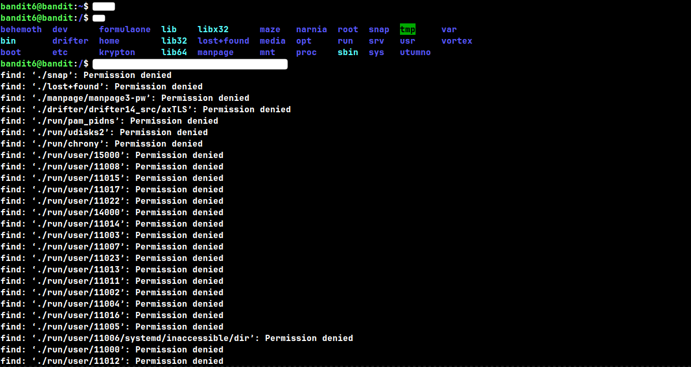
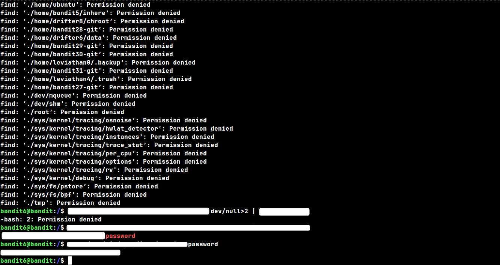

# Level: 6 → 7

# Given Details --

- The password for level 7 is stored somewhere on the ENTIRE filesystem
- The file is owned by user `bandit7`
- The file belongs to group `bandit6`
- The file is exactly 33 bytes in size

# Goal --

- Search the entire filesystem (starting from root) for a file matching the given owner, group, and size, and read the password from it.

# Commands Needed --

	cd, ls, find, grep

# Theory --

## Searching from root --

	Unlike previous levels where the file was inside a specific folder, 
	this one could be ANYWHERE on the system. That means starting your 
	search from "/" (root) instead of your home directory.

## Filtering by user and group --

	`find` can filter by ownership directly, using -user and -group.

#### Syntax:   find {path} -user {username} -group {groupname}  -size {size of the file}

## Cleaning up "Permission denied" errors --

	Searching from root means find will try to look inside folders you 
	don't have permission to read — for every one of those, it prints a 
	"Permission denied" error. These are just noise, they don't affect 
	your actual results.

	To hide them, redirect find's error output to /dev/null, a special 
	file that discards anything sent to it.

#### Syntax:   find {path} {options}  2>/dev/null

	Be careful with the exact syntax here. Writing "2" AFTER the 
	redirect symbol, like this:

		/dev/null>2

	does NOT work — bash reads that as "redirect output INTO a file 
	named 2", not "redirect stderr". The "2" has to come BEFORE the ">" 
	symbol, directly attached to it, with no space: "2>".

	Also note: /dev/null needs the leading slash to reliably point to 
	the actual system device, no matter what folder you're currently 
	in. Leaving off the slash (dev/null instead of /dev/null) only 
	happens to work if your current directory is already "/" — from 
	anywhere else, it would try to create a file in a relative "dev" 
	folder instead.

## Walk-through --

	- With a clean terminal, SSH into bandit6 using the password you 
	  found in the Level 5 → 6 writeup.

	- Move to the root directory and list its contents, just to see 
	  the scale of what you're searching through.

	- Try running find with the owner and group filters given. You'll 
	  likely get flooded with "Permission denied" errors — that's 
	  expected, think about how to silence them.

	- Once the errors are cleaned up, you'll get the file you wanted.

	- Once you've isolated the correct file path, read its contents 
	  the same way you have in previous levels.

