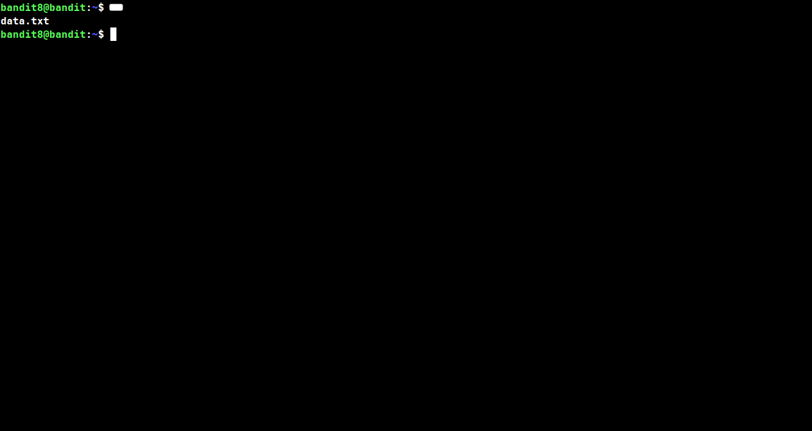
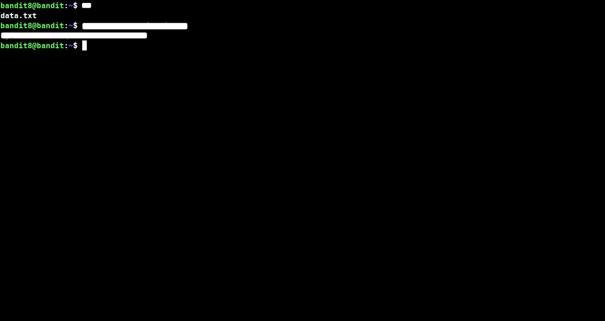

## Level: 8 → 9

# Given Details --

- The password for level 9 is stored in the file `data.txt`
- The password is the only line in the file that occurs exactly once — every other line is repeated
- Username for this level: bandit8

# Goal --

- Find the one unique line in `data.txt` and read the password from it.

# Commands Needed --

```
sort, uniq
```

# Theory --

## sort --

```
sort arranges the lines of a file, alphabetically by default. it doesnt remove or change anything, it just reorders the lines so identical ones end up sitting right next to eachother, which matters alot for the next step.
```

#### Syntax: sort filename

#### Common flags --

```
-r      sorts in reverse order (Z to A, or highest to lowest for numbers)
-n      sorts numerically instead of alphabetically (so 10 comes after 9, not after 1)
-u      sorts and also removes duplicate lines in one go
-f      ignores uppercase/lowercase when sorting
-k      sorts based on a specific column/field instead of the whole line
```

## uniq --

```
uniq only catches duplicate lines when there right next to eachother, its not smart enough to scan a whole unsorted file and find repeats scattered around. thats why its almost always used after sort, once the file is sorted every duplicate line is grouped together and uniq can actually do its job properly.
```

#### Syntax: uniq filename

#### The -u flag --

```
by default uniq just collapses repeated lines down to one copy each, but that still leaves every line in the output, repeated or not. the -u flag flips that around completely, it only prints lines that have no duplicates at all, which is exactly what you want when your looking for the one line that stands out from the rest.
```

#### Syntax: sort filename | uniq -u

#### Common flags --

```
-c      shows a count of how many times each line appeared
-d      only prints lines that ARE duplicated (opposite of -u)
-u      only prints lines that appear exactly once
-i      ignores uppercase/lowercase when comparing lines
```

> ⚠️ **Common mistake:** Running `uniq -u` on a file that hasn't been sorted first won't work properly — it only compares lines that are adjacent to eachother, so scattered duplicates won't get filtered out.

## Walkthrough:

### Checkpoint 1: Listing the home directory

 _After logging into bandit8, list the home directory. There's only one file to work with, `data.txt`, and it likely contains alot of lines, most of them duplicated on purpose to bury the password among them._

### Checkpoint 2: Sorting and filtering for the unique line

 _Pipe `data.txt` through `sort` first so identical lines are grouped together, then hand that off to `uniq -u` to filter out everything except the one line with no duplicate. What's left over is the password for level 9._